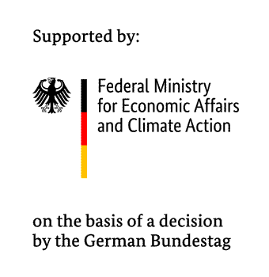

# DataDisAggregation Package

[](https://github.com/wingechr/data-disaggregation/blob/main/LICENSE)
[](https://github.com/wingechr/data-disaggregation)
[](https://pypi.org/project/data-disaggregation/)
[](https://github.com/wingechr/data-disaggregation/actions/workflows/test.yml)
[](https://wingechr.github.io/data-disaggregation/)

DataDisAggregation is a python package that lets you perform weighted aggregations and
weighted disaggregations of data.

Development was funded as part of the IND-E project.



## Install

```bash
pip install data-disaggregation
```
